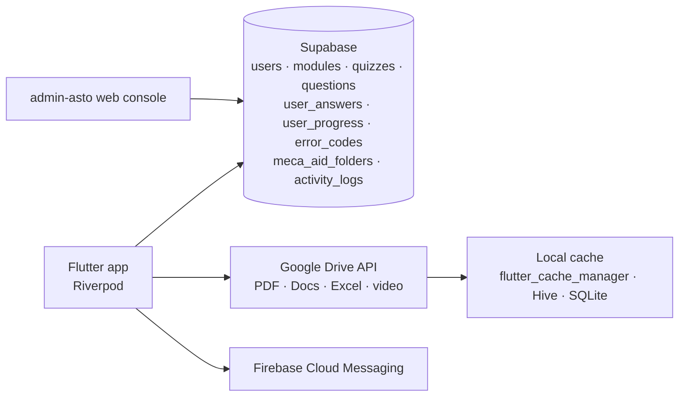

<div align="center">

# 📱 Meca Learning

**Industrial training app for mechanics: learning modules, quizzes, error-code lookup and animations, delivered offline-friendly from Google Drive.**


</div>

---

## Overview

Mechanics on the plant floor need quick access to training material and troubleshooting references: manuals, error codes, animations of how a machine works, and quizzes to check understanding. That material is usually scattered across shared drives and printed binders.

**Meca Learning** brings it into one Android and iOS app:
- The content team keeps working in **Google Drive** as its CMS: PDFs, Google Docs, Excel sheets and videos.
- The app pulls that content, **caches it for offline use**, and tracks what each mechanic has studied.
- Admins monitor progress and activity from an in-app dashboard, with a web console in [`admin-asto`](https://github.com/efrino/admin-asto).

## Features

| Module | What it does |
|---|---|
| **Modules** | Training modules with PDF lessons. Google Docs are exported to PDF on the fly, and files are cached locally after the first download. |
| **Meca Aid** | Folder-based reference library with PDF and **Excel viewers** and video playback |
| **Quizzes** | Quiz list, timed play, result screen, with every answer stored for progress tracking |
| **Error Codes** | Searchable machine error codes, with detail pages and reference images |
| **Animations** | Video animations explaining machine operation (`video_player` + `chewie`) |
| **Activity Log** | Records logins, navigation and study sessions with device info. Logs are **queued offline and synced** when connectivity returns. |
| **Admin Dashboard** | Usage and progress overview for admin users |
| **Push notifications** | Firebase Cloud Messaging with topic subscriptions and local notifications for content updates |

## Architecture



```
lib/
  config/        routes, theme, constants
  core/services/ supabase, auth, gdrive, pdf_cache, activity_log, push_notification
  features/      home · modules · meca_aid (incl. quizzes & Excel viewer) · error_codes
                 animations · activity_log · admin · auth
  shared/        models (user, module, quiz, question, error code, activity log) and common widgets
```

## Tech Stack

| Area | Packages |
|---|---|
| State | `flutter_riverpod`, `riverpod_annotation` |
| Backend | `supabase_flutter` |
| Content | `googleapis`, `googleapis_auth` (Drive), `syncfusion_flutter_pdfviewer`, `excel`, `video_player`, `chewie` |
| Offline | `flutter_cache_manager`, `hive`, `sqflite`, `shared_preferences`, `flutter_secure_storage` |
| Notifications | `firebase_core`, `firebase_messaging`, `flutter_local_notifications` |
| UI | `cached_network_image`, `shimmer`, `google_fonts`, `flutter_svg` |
| CI | Codemagic workflow for iOS builds ([`codemagic.yaml`](codemagic.yaml)) |

## Getting Started

**Requirements:** Flutter (Dart ≥ 3.0), a Supabase project, a Firebase project, and a Google Cloud service account with access to the content folders.

1. Create `assets/.env`:

   ```env
   APP_NAME=Meca Learning
   APP_VERSION=1.0.0
   SUPABASE_URL=...
   SUPABASE_ANON_KEY=...
   GDRIVE_FOLDER_MODULES=...
   GDRIVE_FOLDER_MECA_AID=...
   GDRIVE_FOLDER_ANIMATIONS=...
   GDRIVE_FOLDER_ERROR_IMAGES=...
   ```

2. Put the Google service-account key at `assets/credentials/service_account.json`. This path is git-ignored.
3. Configure Firebase (`flutterfire configure`) for Android and iOS.
4. Run:

   ```bash
   flutter pub get
   flutter run
   ```

iOS builds run on **Codemagic** with the workflow in `codemagic.yaml` (unsigned `xcodebuild` with a deployment target of iOS 15).

## Related

- [**admin-asto**](https://github.com/efrino/admin-asto): React admin console for managing users, modules, quizzes, error codes and activity logs
- [**mechanic-manual-api**](https://github.com/efrino/mechanic-manual-api): Express + MySQL REST API for the mechanic manual app

## Author

**Efrino Wahyu Eko Pambudi**: [GitHub](https://github.com/efrino) · [LinkedIn](https://www.linkedin.com/in/efrinowep/) · [Portfolio](https://efrino.netlify.app)
